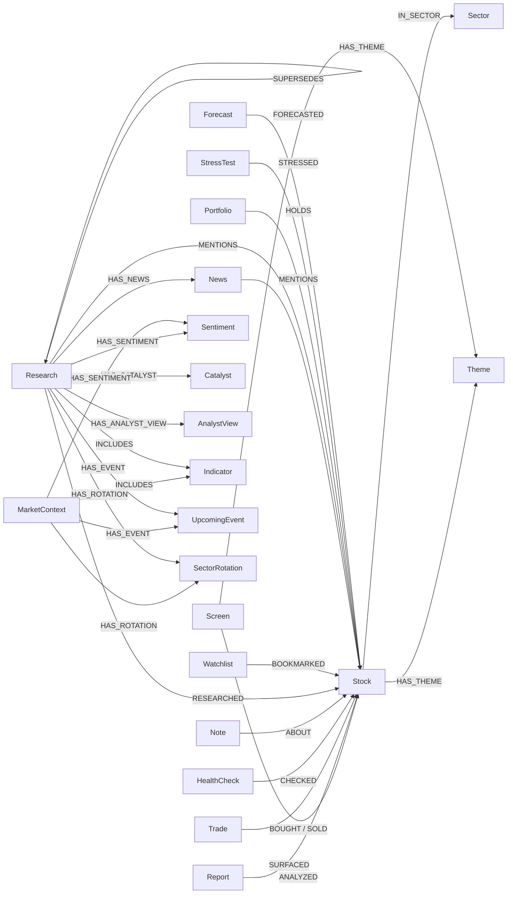

# Neo4j Knowledge Graph Schema

投資ナレッジグラフのスキーマリファレンス。`src/data/graph_store.py` が定義・管理する。

---

## Node Types (21)

### Stock
中心ノード。すべてのアクティビティがこのノードに接続される。

| Property | Type | Description |
|:---|:---|:---|
| symbol | string (UNIQUE) | ティッカーシンボル (e.g. 7203.T, AAPL) |
| name | string | 銘柄名 |
| sector | string | セクター |
| country | string | 国 |

### Screen
スクリーニング実行結果。

| Property | Type | Description |
|:---|:---|:---|
| id | string (UNIQUE) | `screen_{date}_{region}_{preset}` |
| date | string | 実行日 (YYYY-MM-DD) |
| preset | string | プリセット名 (alpha, value, etc.) |
| region | string | 地域 (japan, us, etc.) |
| count | int | ヒット件数 |

### Report
個別銘柄レポート。full モードでは拡張プロパティあり。

| Property | Type | Description |
|:---|:---|:---|
| id | string (UNIQUE) | `report_{date}_{symbol}` |
| date | string | 実行日 |
| symbol | string | 対象銘柄 |
| score | float | バリュースコア (0-100) |
| verdict | string | 判定 (割安/適正/割高) |
| price | float | 株価 (full モードのみ) |
| per | float | PER (full モードのみ) |
| pbr | float | PBR (full モードのみ) |
| dividend_yield | float | 配当利回り (full モードのみ) |
| roe | float | ROE (full モードのみ) |
| market_cap | float | 時価総額 (full モードのみ) |

### Trade
売買記録。

| Property | Type | Description |
|:---|:---|:---|
| id | string (UNIQUE) | `trade_{date}_{type}_{symbol}` |
| date | string | 取引日 |
| type | string | buy / sell |
| symbol | string | 銘柄 |
| shares | int | 株数 |
| price | float | 取引価格 |
| currency | string | 通貨 (JPY/USD/SGD) |
| memo | string | メモ |

### HealthCheck
ヘルスチェック実行結果。

| Property | Type | Description |
|:---|:---|:---|
| id | string (UNIQUE) | `health_{date}` |
| date | string | 実行日 |
| total | int | チェック対象数 |
| healthy | int | 健全銘柄数 |
| exit_count | int | EXIT 判定数 |

### Note
投資メモ。

| Property | Type | Description |
|:---|:---|:---|
| id | string (UNIQUE) | UUID |
| date | string | 作成日 |
| type | string | thesis/observation/concern/review/target/lesson |
| content | string | メモ内容 |
| source | string | 情報ソース |

### Theme
銘柄に付けられたテーマタグ。

| Property | Type | Description |
|:---|:---|:---|
| name | string (UNIQUE) | テーマ名 (e.g. AI, EV, 半導体) |

### Sector
セクター分類。

| Property | Type | Description |
|:---|:---|:---|
| name | string (UNIQUE) | セクター名 (e.g. Technology, Healthcare) |

### Research
深掘りリサーチ結果。

| Property | Type | Description |
|:---|:---|:---|
| id | string (UNIQUE) | `research_{date}_{type}_{target}` |
| date | string | 実行日 |
| research_type | string | stock/industry/market/business |
| target | string | 対象 (銘柄/業界名/市場名) |
| summary | string | 要約 |

### Watchlist
ウォッチリスト。

| Property | Type | Description |
|:---|:---|:---|
| name | string (UNIQUE) | リスト名 |

### MarketContext
市況スナップショット。

| Property | Type | Description |
|:---|:---|:---|
| id | string (UNIQUE) | `market_context_{date}` |
| date | string | 取得日 |
| indices | string (JSON) | 指数データ (JSON 文字列) |

### News (KIK-413 full mode)
ニュース記事。Research から HAS_NEWS で接続。

| Property | Type | Description |
|:---|:---|:---|
| id | string (UNIQUE) | `{research_id}_news_{i}` |
| date | string | 記録日 |
| title | string | 見出し (最大500文字) |
| source | string | ソース (grok/yahoo/publisher名) |
| link | string | URL |

### Sentiment (KIK-413 full mode)
センチメント分析結果。Research/MarketContext から HAS_SENTIMENT で接続。

| Property | Type | Description |
|:---|:---|:---|
| id | string (UNIQUE) | `{parent_id}_sent_{source}` |
| date | string | 記録日 |
| source | string | grok_x / yahoo_x / market |
| score | float | スコア (0.0-1.0) |
| summary | string | 要約 |
| positive | string | ポジティブ要因 (yahoo_x のみ) |
| negative | string | ネガティブ要因 (yahoo_x のみ) |

### Catalyst (KIK-413 full mode, KIK-430 拡張)
好材料・悪材料。Research から HAS_CATALYST で接続。
stock/business: positive/negative。industry: trend/growth_driver/risk/regulatory。

| Property | Type | Description |
|:---|:---|:---|
| id | string (UNIQUE) | `{research_id}_cat_{type}_{i}` |
| date | string | 記録日 |
| type | string | positive / negative / trend / growth_driver / risk / regulatory |
| text | string | 内容 (最大500文字) |

### AnalystView (KIK-413 full mode)
アナリスト見解。Research から HAS_ANALYST_VIEW で接続。

| Property | Type | Description |
|:---|:---|:---|
| id | string (UNIQUE) | `{research_id}_av_{i}` |
| date | string | 記録日 |
| text | string | 見解テキスト (最大500文字) |

### Indicator (KIK-413 full mode, KIK-430 拡張)
マクロ指標スナップショット。MarketContext/Research(market) から INCLUDES で接続。

| Property | Type | Description |
|:---|:---|:---|
| id | string (UNIQUE) | `{context_id}_ind_{i}` |
| date | string | 記録日 |
| name | string | 指標名 (e.g. S&P500, 日経平均) |
| symbol | string | シンボル (e.g. ^GSPC) |
| price | float | 値 |
| daily_change | float | 日次変化率 |
| weekly_change | float | 週次変化率 |

### UpcomingEvent (KIK-413 full mode)
今後のイベント。MarketContext から HAS_EVENT で接続。

| Property | Type | Description |
|:---|:---|:---|
| id | string (UNIQUE) | `{context_id}_event_{i}` |
| date | string | 記録日 |
| text | string | イベント内容 |

### SectorRotation (KIK-413 full mode)
セクターローテーション情報。MarketContext から HAS_ROTATION で接続。

| Property | Type | Description |
|:---|:---|:---|
| id | string (UNIQUE) | `{context_id}_rot_{i}` |
| date | string | 記録日 |
| text | string | ローテーション内容 |

### Portfolio (KIK-414)
ポートフォリオアンカーノード。HOLDS リレーションで保有銘柄に接続。

| Property | Type | Description |
|:---|:---|:---|
| name | string (UNIQUE) | ポートフォリオ名 (デフォルト: "default") |

### StressTest (KIK-428)
ストレステスト実行結果。STRESSED リレーションで対象銘柄に接続。

| Property | Type | Description |
|:---|:---|:---|
| id | string (UNIQUE) | `stress_test_{date}_{scenario}` |
| date | string | 実行日 (YYYY-MM-DD) |
| scenario | string | シナリオ名 (トリプル安, テック暴落, etc.) |
| portfolio_impact | float | PF全体の推定損失率 |
| var_95 | float | 95% VaR (日次) |
| var_99 | float | 99% VaR (日次) |
| symbol_count | int | 対象銘柄数 |

### Forecast (KIK-428)
フォーキャスト（将来予測）実行結果。FORECASTED リレーションで対象銘柄に接続。

| Property | Type | Description |
|:---|:---|:---|
| id | string (UNIQUE) | `forecast_{date}` |
| date | string | 実行日 (YYYY-MM-DD) |
| optimistic | float | 楽観シナリオ推定リターン (%) |
| base | float | ベースシナリオ推定リターン (%) |
| pessimistic | float | 悲観シナリオ推定リターン (%) |
| total_value_jpy | float | PF時価総額 (円) |
| symbol_count | int | 対象銘柄数 |

---

## Relationships



| Relationship | From | To | Description |
|:---|:---|:---|:---|
| SURFACED | Screen | Stock | スクリーニングで検出された |
| ANALYZED | Report | Stock | レポートで分析された |
| BOUGHT | Trade | Stock | 購入取引 |
| SOLD | Trade | Stock | 売却取引 |
| CHECKED | HealthCheck | Stock | ヘルスチェック対象 |
| ABOUT | Note | Stock | メモの対象銘柄 |
| IN_SECTOR | Stock | Sector | セクター分類 |
| HAS_THEME | Stock/Screen | Theme | テーマタグ |
| RESEARCHED | Research | Stock | リサーチ対象 (stock/business タイプのみ) |
| BOOKMARKED | Watchlist | Stock | ウォッチ対象 |
| SUPERSEDES | Research | Research | 同じ対象の新旧リサーチチェーン (日付順) |
| HAS_NEWS | Research | News | リサーチに紐づくニュース (KIK-413) |
| MENTIONS | News | Stock | ニュースが言及する銘柄 (KIK-413) |
| HAS_SENTIMENT | Research/MarketContext | Sentiment | センチメント分析結果 (KIK-413) |
| HAS_CATALYST | Research | Catalyst | 好材料・悪材料 (KIK-413) |
| HAS_ANALYST_VIEW | Research | AnalystView | アナリスト見解 (KIK-413) |
| INCLUDES | Research(market)/MarketContext | Indicator | マクロ指標値 (KIK-413/430) |
| HAS_EVENT | Research(market)/MarketContext | UpcomingEvent | 今後のイベント (KIK-413/430) |
| HAS_ROTATION | Research(market)/MarketContext | SectorRotation | セクターローテーション (KIK-413/430) |
| MENTIONS | Research(industry) | Stock | 業界リサーチで言及された銘柄 (KIK-430) |
| HOLDS | Portfolio | Stock | 現在保有中の銘柄 (KIK-414)。プロパティ: shares, cost_price, cost_currency, purchase_date |
| STRESSED | StressTest | Stock | ストレステスト対象銘柄 (KIK-428)。プロパティ: impact (推定損失率) |
| FORECASTED | Forecast | Stock | フォーキャスト対象銘柄 (KIK-428)。プロパティ: optimistic, base, pessimistic (各シナリオリターン) |

---

## Constraints (21)

```cypher
CREATE CONSTRAINT stock_symbol IF NOT EXISTS FOR (s:Stock) REQUIRE s.symbol IS UNIQUE
CREATE CONSTRAINT screen_id IF NOT EXISTS FOR (s:Screen) REQUIRE s.id IS UNIQUE
CREATE CONSTRAINT report_id IF NOT EXISTS FOR (r:Report) REQUIRE r.id IS UNIQUE
CREATE CONSTRAINT trade_id IF NOT EXISTS FOR (t:Trade) REQUIRE t.id IS UNIQUE
CREATE CONSTRAINT health_id IF NOT EXISTS FOR (h:HealthCheck) REQUIRE h.id IS UNIQUE
CREATE CONSTRAINT note_id IF NOT EXISTS FOR (n:Note) REQUIRE n.id IS UNIQUE
CREATE CONSTRAINT theme_name IF NOT EXISTS FOR (t:Theme) REQUIRE t.name IS UNIQUE
CREATE CONSTRAINT sector_name IF NOT EXISTS FOR (s:Sector) REQUIRE s.name IS UNIQUE
CREATE CONSTRAINT research_id IF NOT EXISTS FOR (r:Research) REQUIRE r.id IS UNIQUE
CREATE CONSTRAINT watchlist_name IF NOT EXISTS FOR (w:Watchlist) REQUIRE w.name IS UNIQUE
CREATE CONSTRAINT market_context_id IF NOT EXISTS FOR (m:MarketContext) REQUIRE m.id IS UNIQUE
-- KIK-413 full-mode nodes
CREATE CONSTRAINT news_id IF NOT EXISTS FOR (n:News) REQUIRE n.id IS UNIQUE
CREATE CONSTRAINT sentiment_id IF NOT EXISTS FOR (s:Sentiment) REQUIRE s.id IS UNIQUE
CREATE CONSTRAINT catalyst_id IF NOT EXISTS FOR (c:Catalyst) REQUIRE c.id IS UNIQUE
CREATE CONSTRAINT analyst_view_id IF NOT EXISTS FOR (a:AnalystView) REQUIRE a.id IS UNIQUE
CREATE CONSTRAINT indicator_id IF NOT EXISTS FOR (i:Indicator) REQUIRE i.id IS UNIQUE
CREATE CONSTRAINT upcoming_event_id IF NOT EXISTS FOR (e:UpcomingEvent) REQUIRE e.id IS UNIQUE
CREATE CONSTRAINT sector_rotation_id IF NOT EXISTS FOR (r:SectorRotation) REQUIRE r.id IS UNIQUE
-- KIK-414 portfolio sync
CREATE CONSTRAINT portfolio_name IF NOT EXISTS FOR (p:Portfolio) REQUIRE p.name IS UNIQUE
-- KIK-428 stress test / forecast
CREATE CONSTRAINT stress_test_id IF NOT EXISTS FOR (st:StressTest) REQUIRE st.id IS UNIQUE
CREATE CONSTRAINT forecast_id IF NOT EXISTS FOR (f:Forecast) REQUIRE f.id IS UNIQUE
```

## Indexes (14)

```cypher
CREATE INDEX stock_sector IF NOT EXISTS FOR (s:Stock) ON (s.sector)
CREATE INDEX screen_date IF NOT EXISTS FOR (s:Screen) ON (s.date)
CREATE INDEX report_date IF NOT EXISTS FOR (r:Report) ON (r.date)
CREATE INDEX trade_date IF NOT EXISTS FOR (t:Trade) ON (t.date)
CREATE INDEX note_type IF NOT EXISTS FOR (n:Note) ON (n.type)
CREATE INDEX research_date IF NOT EXISTS FOR (r:Research) ON (r.date)
CREATE INDEX research_type IF NOT EXISTS FOR (r:Research) ON (r.research_type)
CREATE INDEX market_context_date IF NOT EXISTS FOR (m:MarketContext) ON (m.date)
-- KIK-413 full-mode indexes
CREATE INDEX news_date IF NOT EXISTS FOR (n:News) ON (n.date)
CREATE INDEX sentiment_source IF NOT EXISTS FOR (s:Sentiment) ON (s.source)
CREATE INDEX catalyst_type IF NOT EXISTS FOR (c:Catalyst) ON (c.type)
CREATE INDEX indicator_date IF NOT EXISTS FOR (i:Indicator) ON (i.date)
-- KIK-428 stress test / forecast
CREATE INDEX stress_test_date IF NOT EXISTS FOR (st:StressTest) ON (st.date)
CREATE INDEX forecast_date IF NOT EXISTS FOR (f:Forecast) ON (f.date)
```

## Vector Indexes (9) — KIK-420/428

TEI (Text Embeddings Inference) で生成した384次元ベクトルによるコサイン類似検索用。
各ノードに `semantic_summary` (テンプレート生成テキスト) と `embedding` (384次元ベクトル) プロパティを追加。

```cypher
CREATE VECTOR INDEX screen_embedding IF NOT EXISTS FOR (s:Screen) ON (s.embedding)
  OPTIONS {indexConfig: {`vector.dimensions`: 384, `vector.similarity_function`: 'cosine'}}
CREATE VECTOR INDEX report_embedding IF NOT EXISTS FOR (r:Report) ON (r.embedding)
  OPTIONS {indexConfig: {`vector.dimensions`: 384, `vector.similarity_function`: 'cosine'}}
CREATE VECTOR INDEX trade_embedding IF NOT EXISTS FOR (t:Trade) ON (t.embedding)
  OPTIONS {indexConfig: {`vector.dimensions`: 384, `vector.similarity_function`: 'cosine'}}
CREATE VECTOR INDEX healthcheck_embedding IF NOT EXISTS FOR (h:HealthCheck) ON (h.embedding)
  OPTIONS {indexConfig: {`vector.dimensions`: 384, `vector.similarity_function`: 'cosine'}}
CREATE VECTOR INDEX research_embedding IF NOT EXISTS FOR (r:Research) ON (r.embedding)
  OPTIONS {indexConfig: {`vector.dimensions`: 384, `vector.similarity_function`: 'cosine'}}
CREATE VECTOR INDEX marketcontext_embedding IF NOT EXISTS FOR (m:MarketContext) ON (m.embedding)
  OPTIONS {indexConfig: {`vector.dimensions`: 384, `vector.similarity_function`: 'cosine'}}
CREATE VECTOR INDEX note_embedding IF NOT EXISTS FOR (n:Note) ON (n.embedding)
  OPTIONS {indexConfig: {`vector.dimensions`: 384, `vector.similarity_function`: 'cosine'}}
-- KIK-428 stress test / forecast
CREATE VECTOR INDEX stresstest_embedding IF NOT EXISTS FOR (st:StressTest) ON (st.embedding)
  OPTIONS {indexConfig: {`vector.dimensions`: 384, `vector.similarity_function`: 'cosine'}}
CREATE VECTOR INDEX forecast_embedding IF NOT EXISTS FOR (f:Forecast) ON (f.embedding)
  OPTIONS {indexConfig: {`vector.dimensions`: 384, `vector.similarity_function`: 'cosine'}}
```

**使い方:**
```cypher
-- ベクトル類似検索（上位5件）
CALL db.index.vector.queryNodes('report_embedding', 5, $embedding)
YIELD node, score
RETURN node.semantic_summary, node.date, score
ORDER BY score DESC
```

---

## Sample Cypher Queries

### 1. 銘柄の全履歴を取得
```cypher
MATCH (s:Stock {symbol: "7203.T"})
OPTIONAL MATCH (sc:Screen)-[:SURFACED]->(s)
OPTIONAL MATCH (r:Report)-[:ANALYZED]->(s)
OPTIONAL MATCH (t:Trade)-[:BOUGHT|SOLD]->(s)
OPTIONAL MATCH (n:Note)-[:ABOUT]->(s)
RETURN s, collect(DISTINCT sc) AS screens,
       collect(DISTINCT r) AS reports,
       collect(DISTINCT t) AS trades,
       collect(DISTINCT n) AS notes
```

### 2. 繰り返しスクリーニングに出るが未購入の銘柄
```cypher
MATCH (sc:Screen)-[:SURFACED]->(s:Stock)
WHERE NOT exists { MATCH (:Trade)-[:BOUGHT]->(s) }
WITH s.symbol AS symbol, count(sc) AS cnt, max(sc.date) AS last_date
WHERE cnt >= 2
RETURN symbol, cnt, last_date
ORDER BY cnt DESC
```

### 3. 直近のリサーチ SUPERSEDES チェーン
```cypher
MATCH (r:Research {research_type: "stock", target: "7203.T"})
RETURN r.date AS date, r.summary AS summary
ORDER BY r.date DESC LIMIT 5
```

### 4. 特定テーマに関連する銘柄一覧
```cypher
MATCH (s:Stock)-[:HAS_THEME]->(t:Theme {name: "AI"})
RETURN s.symbol, s.name, s.sector
```

### 5. ある銘柄の取引履歴 + メモ
```cypher
MATCH (t:Trade)-[:BOUGHT|SOLD]->(s:Stock {symbol: "AAPL"})
RETURN t.date, t.type, t.shares, t.price
ORDER BY t.date DESC
UNION ALL
MATCH (n:Note)-[:ABOUT]->(s:Stock {symbol: "AAPL"})
RETURN n.date, n.type AS type, n.content AS content, null AS price
ORDER BY n.date DESC
```

---

### 6. 銘柄のニュース履歴 (KIK-413)
```cypher
MATCH (n:News)-[:MENTIONS]->(s:Stock {symbol: "NVDA"})
RETURN n.date AS date, n.title AS title, n.source AS source
ORDER BY n.date DESC LIMIT 10
```

### 7. センチメント推移 (KIK-413)
```cypher
MATCH (r:Research)-[:RESEARCHED]->(s:Stock {symbol: "NVDA"})
MATCH (r)-[:HAS_SENTIMENT]->(sent:Sentiment)
RETURN sent.date AS date, sent.source AS source, sent.score AS score
ORDER BY sent.date DESC
```

### 8. カタリスト一覧 (KIK-413)
```cypher
MATCH (r:Research)-[:RESEARCHED]->(s:Stock {symbol: "NVDA"})
MATCH (r)-[:HAS_CATALYST]->(c:Catalyst)
RETURN c.type AS type, c.text AS text
ORDER BY r.date DESC
```

### 9. バリュエーション推移 (KIK-413)
```cypher
MATCH (r:Report)-[:ANALYZED]->(s:Stock {symbol: "7203.T"})
RETURN r.date, r.score, r.verdict, r.price, r.per, r.pbr
ORDER BY r.date DESC LIMIT 10
```

### 10. 今後のイベント (KIK-413)
```cypher
MATCH (m:MarketContext)-[:HAS_EVENT]->(e:UpcomingEvent)
RETURN e.date AS date, e.text AS text
ORDER BY m.date DESC LIMIT 10
```

### 11. 現在の保有銘柄一覧 (KIK-414)
```cypher
MATCH (p:Portfolio {name: 'default'})-[r:HOLDS]->(s:Stock)
RETURN s.symbol AS symbol, r.shares AS shares,
       r.cost_price AS cost_price, r.cost_currency AS cost_currency,
       r.purchase_date AS purchase_date
ORDER BY s.symbol
```

### 12. ストレステスト履歴 (KIK-428)
```cypher
MATCH (st:StressTest)
RETURN st.date AS date, st.scenario AS scenario,
       st.portfolio_impact AS impact, st.var_95 AS var_95
ORDER BY st.date DESC LIMIT 5
```

### 13. 特定銘柄のストレステスト履歴 (KIK-428)
```cypher
MATCH (st:StressTest)-[r:STRESSED]->(s:Stock {symbol: "7203.T"})
RETURN st.date AS date, st.scenario AS scenario, r.impact AS impact
ORDER BY st.date DESC
```

### 14. フォーキャスト履歴 (KIK-428)
```cypher
MATCH (f:Forecast)
RETURN f.date AS date, f.optimistic AS optimistic,
       f.base AS base, f.pessimistic AS pessimistic,
       f.total_value_jpy AS total_value_jpy
ORDER BY f.date DESC LIMIT 5
```

---

## NEO4J_MODE (KIK-413)

`NEO4J_MODE` 環境変数で Neo4j への書き込み深度を制御する。

| Mode | Description |
|:---|:---|
| `off` | Neo4j 書き込みなし (JSON のみ) |
| `summary` | 従来の要約のみ (score/verdict/summary) — 後方互換 |
| `full` | 意味情報サブノード (News/Sentiment/Catalyst 等) も展開 |

**デフォルト**: 環境変数未設定時は Neo4j 接続可能なら `full`、不可なら `off`。

```bash
# fullモードでリサーチ実行
NEO4J_MODE=full python3 .claude/skills/market-research/scripts/run_research.py stock NVDA

# summaryモードで後方互換動作
NEO4J_MODE=summary python3 .claude/skills/stock-report/scripts/generate_report.py 7203.T

# Neo4j書き込み無効
NEO4J_MODE=off python3 .claude/skills/stock-report/scripts/generate_report.py 7203.T
```

---

## Dual-Write Pattern

```
User Action (e.g. buy)
  │
  ├─ 1. JSON Write (master) ← 必ず成功
  │     portfolio.csv / data/notes/*.json / data/history/*.json
  │
  └─ 2. Neo4j Write (view) ← try/except, 失敗しても OK
        graph_store.merge_trade() / merge_note() / etc.
```

- JSON ファイルが master データソース。すべての read/write は JSON 経由
- Neo4j は検索・関連付け用の view。`graph_store.py` の全関数は例外を握りつぶして `False` を返す
- Neo4j が落ちていても全スキルが正常動作する

---

## KIK-433: 業界コンテキスト連携（Phase 1）

業界リサーチで蓄積された Catalyst ノードをフォーキャスト・レポートに反映する。

### 現在のクエリパターン（Phase 1）

`graph_query.get_sector_catalysts(sector, days=30)`:

```cypher
-- セクターマッチ（case-insensitive CONTAINS）
MATCH (r:Research {research_type: 'industry'})-[:HAS_CATALYST]->(c:Catalyst)
WHERE r.date >= $since
  AND (toLower(r.target) CONTAINS toLower($sector)
       OR toLower($sector) CONTAINS toLower(r.target))
RETURN c.type AS type, c.text AS text
ORDER BY r.date DESC LIMIT 50
```

- `growth_driver` → ポジティブ（optimistic シナリオを +N×1.7% 上方修正）
- `risk` → ネガティブ（pessimistic シナリオを -N×1.7% 下方修正）
- 調整上限: ±10%

`graph_query.get_industry_research_for_sector(sector, days=30)`:

```cypher
MATCH (r:Research {research_type: 'industry'})
WHERE r.date >= $since
  AND (toLower(r.target) CONTAINS toLower($sector)
       OR toLower($sector) CONTAINS toLower(r.target))
OPTIONAL MATCH (r)-[:HAS_CATALYST]->(c:Catalyst)
RETURN r.date AS date, r.target AS target, r.summary AS summary,
       collect({type: c.type, text: c.text}) AS catalysts
ORDER BY r.date DESC LIMIT 5
```

### Phase 2（計画中）

以下のリレーションを追加予定:

| リレーション | From → To | 意味 |
|:---|:---|:---|
| `INFLUENCES` | Research(industry) → Stock | 業界リサーチが個別銘柄に影響 |
| `INFORMS` | MarketContext → Forecast | 市況がフォーキャストの前提条件 |
| `SUPPORTS` / `CONTRADICTS` | Research(industry) → Report | 業界トレンドがレポートの判断を補強/矛盾 |
| `CONTEXT_OF` | Research(market) → HealthCheck | 市況がヘルスチェックの解釈文脈 |
